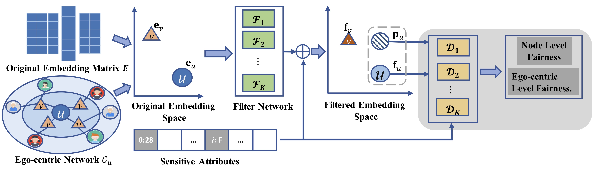

# FairGo WWW2021

Learning Fair Representations for Recommendation: A Graph-based Perspective



As a key application of artificial intelligence, recommender systems are among the most pervasive computer aided systems to help users find potential items of interests. Recently, researchers paid considerable attention to fairness issues for artificial intelligence applications. Most of these approaches assumed independence of instances, and designed sophisticated models to eliminate the sensitive information to facilitate fairness. However, recommender systems differ greatly from these approaches as users and items naturally form a user-item bipartite graph, and are collaboratively correlated in the graph structure. In this paper, we propose a novel graph based technique for ensuring fairness of any recommendation models. Here, the fairness requirements refer to not exposing sensitive feature set in the user modeling process. Specifically, given the original embeddings from any recommendation models, we learn a composition of filters that transform each user's and each item's original embeddings into a filtered embedding space based on the sensitive feature set. For each user, this transformation is achieved under the adversarial learning of a user-centric graph, in order to obfuscating each sensitive feature between both the filtered user embedding and the sub graph structures of this user. Finally, extensive experimental results clearly show the effectiveness of our proposed model for fair recommendation.

We provide PyTorch implementations for FairGo model.

## Prerequisites

- PyTorch
- Python 3.5
- CPU or NVIDIA GPU + CUDA CuDNN

## Getting Started

### Installation

- Clone this repo:

```bash
git clone https://github.com/newlei/FairGo.git
cd FairGo
cd code
```

### Code
Code on MovieLens-1M. Please open “code/code_ml”.  

Code on Lastfm-360K. Please open “code/code_lastfm”.

### Datasets
In order to speed up model training, the original dataset was processed to form a variety of intermediate data. Because these intermediate data of MovieLens-1M and Lastfm-360K occupy too much space, it cannot be completely put on GitHub which allows max file size to 100 MB. Therefore, some intermediate data is missing. We release all data in [link](https://mailhfuteducn-my.sharepoint.com/:f:/g/personal/chenlei_2016_mail_hfut_edu_cn/Ek2vQvtMA8tPrKyMV9hQriYBxPEYpVARhE79QIsn4DPQew?e=wUSyTi).

- We release all data in [link](https://mailhfuteducn-my.sharepoint.com/:f:/g/personal/chenlei_2016_mail_hfut_edu_cn/Ek2vQvtMA8tPrKyMV9hQriYBxPEYpVARhE79QIsn4DPQew?e=wUSyTi).


## Citation 
If you find this useful for your research, please kindly cite the following paper
that crawal and analyze the data.

```
@article{wu2021learn,
  title={Learning Fair Representations for Recommendation: A Graph-based Perspective},
  author={Le Wu, Lei Chen, Pengyang Shao, Richang Hong, Xiting Wang and Meng Wang}
  journal={WWW},
  year={2021}
}
```
Besides, you may find these following works are useful for understanding GCN-based recommendation.
```
@article{chen2019revis,
  title={Revisiting Graph based Collaborative Filtering: A Linear Residual Graph Convolutional Network Approach},
  author={Lei, Chen and Le, Wu and  Richang, Hong and Kun, Zhang and Meng, Wang}
  journal={AAAI},
  year={2019}
}
```


## Acknowledgments
We thank LMC lab. of Hefei University of Technology


